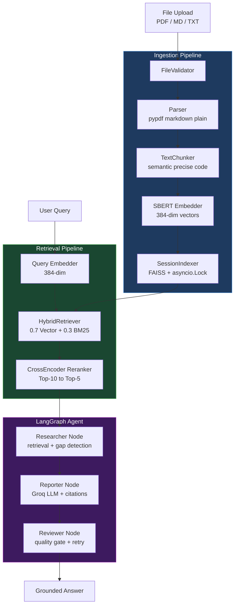

# AI Knowledge Work Assistant

AI Knowledge Work Assistant is a document question-answering system focused on retrieval quality, session isolation, and traceable answers. Users upload PDF or Markdown files, the system parses and indexes the content, and the RAG pipeline retrieves relevant passages through hybrid search and cross-encoder re-ranking.

The project has completed the core RAG runtime foundation and the agent workflow prototype (Epic 3), including LangGraph orchestration, Groq-backed answer generation, and Tavily web search fallback. Streaming UI and deployment automation are planned next.

## System Architecture



## Current Capabilities

- PDF and Markdown parsing with source metadata.
- Session-isolated in-memory FAISS indexes.
- Text chunking and multilingual sentence-transformer embeddings.
- Hybrid retrieval using vector search and CJK-aware keyword scoring.
- Document-type chunking profiles for semantic, precise, and code-heavy content.
- Cross-encoder re-ranking for improving final retrieval order.
- Runtime guardrails for ingestion failure handling, citation metadata, retrieval boundaries, and re-ranking failures.
- English developer-facing comments, logs, exceptions, and tests for cleaner public review.
- LangGraph agent workflow with real researcher node (HybridRetriever integration), Groq-backed reporter node, and Tavily web search fallback with conditional graph routing.
- Multilingual retrieval foundation using `paraphrase-multilingual-MiniLM-L12-v2` and CJK-aware keyword tokenization.
- Groq-backed answer generation with citation-aware prompt assembly and graceful fallback handling.
- Unit tests for parser, chunker, embeddings, indexing, retrieval, re-ranking, and runtime hardening behavior.

## Tech Stack

| Area | Technology |
| --- | --- |
| Language | Python 3.11+ |
| API | FastAPI |
| UI | Streamlit |
| RAG index | FAISS, in-memory per session |
| Embeddings | sentence-transformers |
| Re-ranking | cross-encoder/ms-marco-MiniLM-L-6-v2 |
| Testing | pytest |
| Dependency management | uv |
| Orchestration foundation | LangGraph |
| Planned deployment | Docker, GitHub Actions, Hugging Face Spaces |

## Project Structure

```text
api/
  main.py                 FastAPI app and health endpoint
app/
  main.py                 Streamlit app bootstrap
core/
  config.py               Environment-driven settings
  log.py                  Shared logger
  agent/
    nodes.py              Node functions for LangGraph agent workflow
    graph.py              StateGraph factory with conditional routing
    state.py              AgentState TypedDict schema
    exceptions.py         WebSearchException domain exception
  rag/
    parser.py             PDF and Markdown parsing
    chunker.py            Text chunking and chunking profiles
    embeddings.py         Sentence-transformer embeddings
    indexer.py            Session-scoped FAISS index registry
    pipeline.py           Ingestion pipeline
    retriever.py          Hybrid vector and keyword retrieval
    reranker.py           Cross-encoder re-ranking
    generator.py          Groq-backed answer generation with citations
tests/
  unit/                   Core unit tests
  integration/            API integration tests
docs/
  product-requirements.md Public product requirements
  architecture.md         Public architecture overview
  roadmap.md              Public roadmap and release strategy
  stories/                Public story specifications
```

## Quick Start

Install dependencies:

```powershell
uv sync --group dev
```

Create a local environment file:

```powershell
Copy-Item .env.example .env
```

Run tests:

```powershell
uv run pytest
```

Run the API:

```powershell
uv run python -m api.main
```

Run the Streamlit app:

```powershell
uv run streamlit run app/main.py
```

## Documentation

- [Product Requirements](docs/product-requirements.md)
- [Architecture](docs/architecture.md)
- [Engineering Standards](docs/engineering-standards.md)
- [Roadmap and Release Strategy](docs/roadmap.md)
- [Story Specifications](docs/stories)
- [Changelog](CHANGELOG.md)

## Development Status

The repository has completed Epics 1–3: RAG runtime foundation, runtime hardening, codebase normalization, LangGraph agent workflow (researcher, reporter, web search), multilingual retrieval, and LLM answer generation. The next planned direction is the Epic 4 streaming UI and Story 3.5 reviewer quality gate.

See [docs/roadmap.md](docs/roadmap.md) for the versioning plan.
